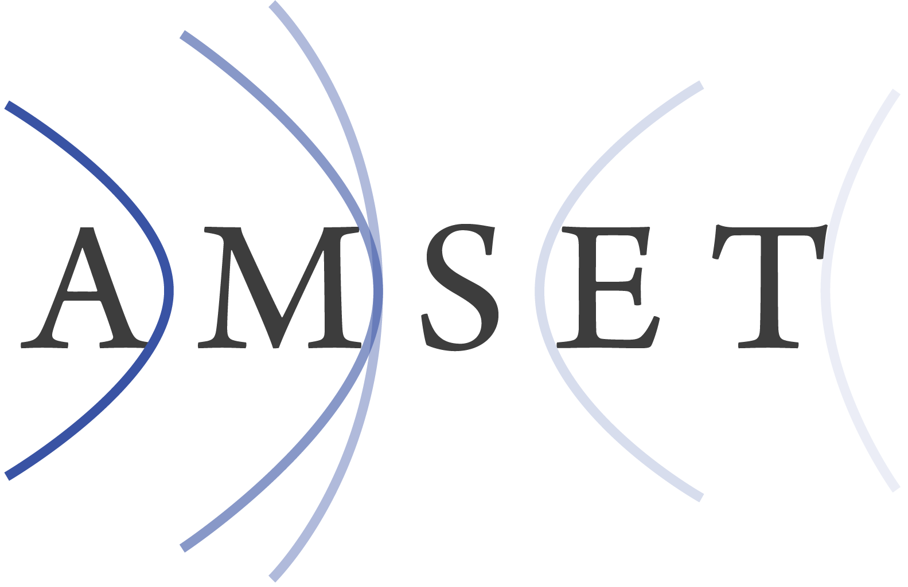

# 

Ab initio Model for Mobility and Seebeck coefficient using Boltzmann Transport equation. AMSET (a.k.a aMoBT) in Python is currently in development and is not functional.

Interested in contributing? See our [contribution guidelines](https://github.com/hackingmaterials/amset/blob/master/CONTRIBUTING.md)
